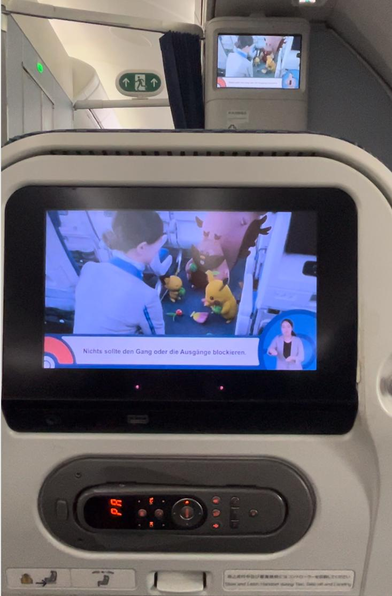
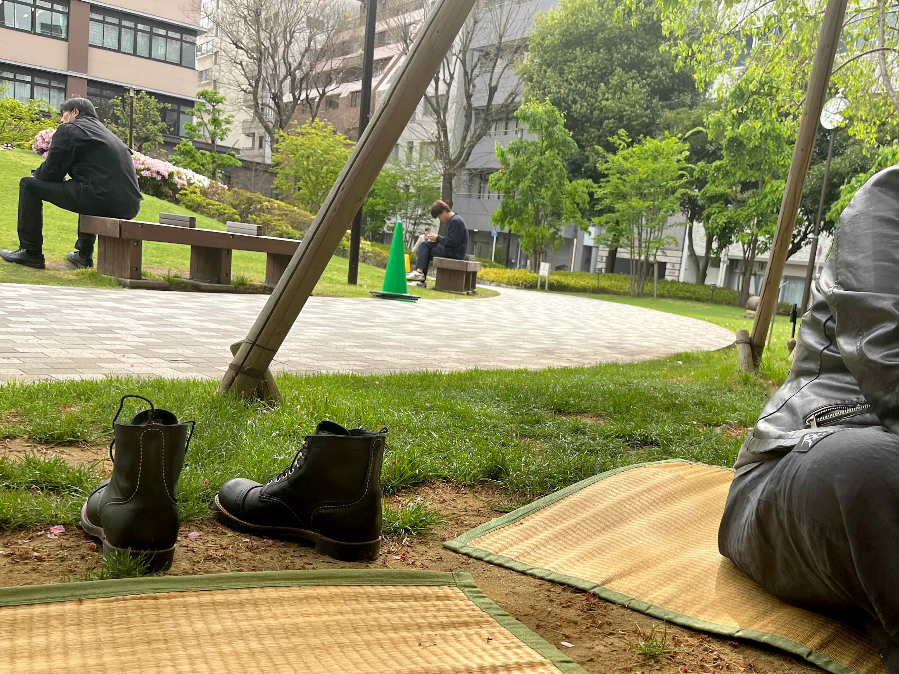
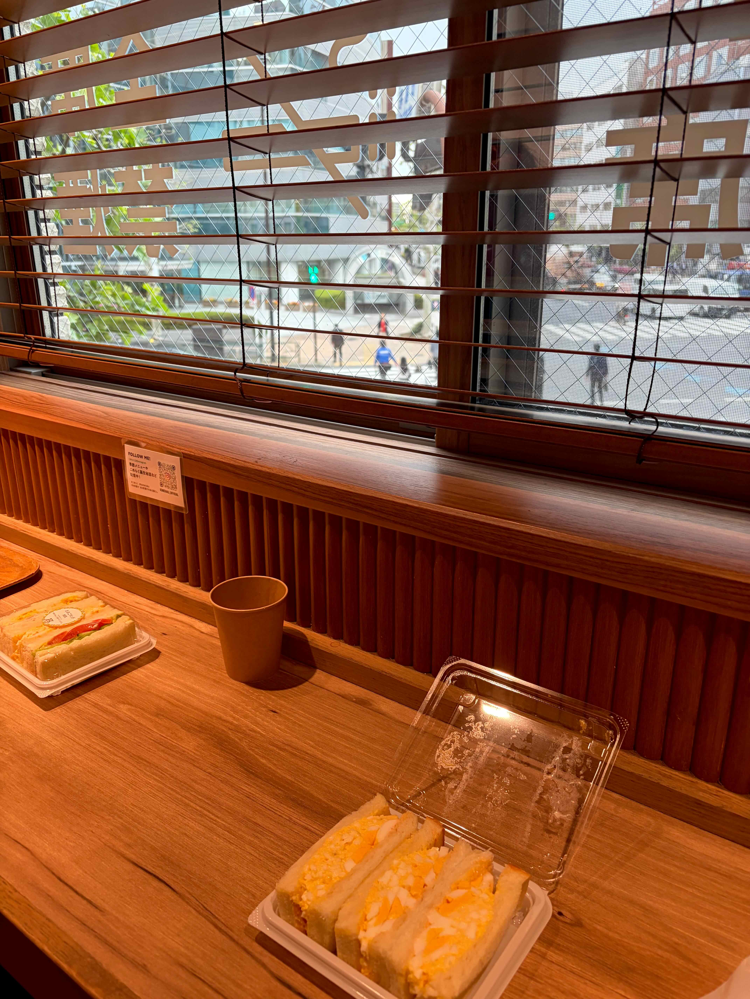

+++
date = '2026-09-11T20:30:00+02:00'
draft = false
title = 'Japan, Part 1. Flight and Tokyo'
tags = ['travel', 'japan', 'life']
type = "posts"
+++

It's the end of vacation season now, so I'll write about our recent one - starting a new Travel tag in this blog. It's September now, but the trip itself happened back in April-May this year. We'd been planning to go to Japan the previous spring, but were too busy to properly plan it, so we only made it this year - though for a full three weeks, and it was really great.

We liked pretty much everything there: the food, the people, the nature, the cities, the transport system. We bought so much geeky stuff that we had to buy a new large suitcase. But let's take it one step at a time. I'll split the story into several parts and write them little by little - otherwise it will turn into a huge wall of text that I'll never finish :)

<!--more-->

## The Flight

Originally we were planning to fly via Dubai, but after certain well-known events we decided not to risk it and booked a direct Lufthansa flight from Munich to Tokyo and back. It cost about twice as much, but it saved us a lot of anxiety: we didn't have to wonder whether the layover would work out, whether flights would get cancelled, or whether we'd have to urgently come up with a new route. It also turned out more convenient - you power through fors 14-15 hours once, and you're at the destination.

We took off around nine in the morning, flew all day and night, and landed at about six in the morning local time. Getting into travel mood started right on the plane: they served Japanese food (and one of the dishes on the menu was marked as recommended), the pre-flight safety instructions featured Pokémon, and for drinks they offered Japanese beer - of course, we tried a few different kinds of it.

## The First Day

After landing and catching our breath a bit, we went looking for an ATM (we read that cash is fairly popular in Japan). We also used a [luggage delivery service](https://www.global-yamato.com/) so we wouldn't have to lug our bags around ourselves. Luggage forwarding is a very convenient and pretty flexible thing - we used it many times throughout the trip, sending our suitcases between cities and traveling light.

Tokyo greeted us with nice weather and crowds of Japanese people heading to work. The hotel wouldn't check us in early, so we left our stuff in a luggage locker and went for a walk around. We found a tiny park ([📍](https://maps.app.goo.gl/iboi2kLcnom25GAN6)), grabbed a couple of free public straw mats, and lay down to relax under a tree. I even managed to get about an hour of sleep, after which it was finally time to go and check in.

We weren't planing much for the first day - we walked around a bit and went looking for food. Here we encountered the first unexpected problem: many popular places in Tokyo have queues of anywhere from 15 minutes to an hour, sometimes even more in extreme cases. I bookmarked a bunch of restaurants beforehand based on TikTok recommendations, but almost all of the ones in the neighborhood had long lines. We did eventually make it into one of them some other day, after waiting for about forty minutes; it turned out to be visually interesting but totally unimpressive in terms of food - it felt like some kind of social media bait. In contrast, food at random restaurants almost always turned out to be very tasty. In the end, on the first evening we were so exhausted that, having failed to get into a full izakaya, we just stopped by a konbini, grabbed some instant noodles, sushi, and other bits, had a hotel dinner, and went to sleep.

## The Morning Café

For the first few days we had breakfast at a coffee shop / sandwich place ([📍](https://maps.app.goo.gl/dn4xXc1g5QYN5XUs5)) near the hotel. We liked it so much that two weeks later, when we were staying in the same area again before flying home, we started going there again. They served pretty decent coffee, plus I got so hooked on their egg sandwiches that I later learned to make them at home, using the memory of the taste as a reference.

But what I liked there most was the atmosphere. You sit on the second floor, drink your coffee, eat your breakfast, and look out the window at an intersection where everyone's rushing somewhere, while some chill music plays in the background, reminding you of a small fishing village in a JRPG. Very atmospheric.

## Buying an iPhone

One of the first goals was to buy a new iPhone. When I was getting ready for the trip, I was deciding whether to bring a DSLR or, as usual, just shoot on my phone. Looking into it, I found out that Japan has some of the cheapest iPhones in the world, especially if you do Tax Free.

First we went to the Apple Store, where we confirmed what Claude was warning me about - it turned out Apple hasn't been doing Tax Free for several years now. Resellers were abusing it too aggressively, buying hundreds of phones and taking them out to other countries. Since Tax Free only applies to purchases for personal use, at some point Apple got fined and discontinued the program. In the end I bought the tax-free phone at Bic Camera in Ginza district, and for the rest of the trip I took pics with it instead of a DSLR.

## Ueno Park

On one of the first days we went to Ueno Park - a pleasant place with several shrines, in front of one of which grows that very ["looped" pine from the ancient painting](https://www.edwardluperart.com/post/the-moon-pine-in-ueno-park). In the same park we randomly stumbled onto a sake festival: we didn't stay long, but it was loud and fun. We also stopped by a peony exhibition, walked around the pond, and just had a nice couple of hours.


ueno/1.jpg | That very pine
ueno/2.jpg | Torii gates at one of the temples
ueno/3.jpg | Temples sell tablets for good luck and other blessings
ueno/4.jpg | '
ueno/5.jpg | '
ueno/6.jpg | '


## Kaiten Sushi

The same day we went to try one of the many conveyor-belt sushi places in Ginza. Overall it was okay, but I wouldn't recommend this particular spot - another TikTok place, and a very touristy one at that. We took a number from the machine and waited two hours for our turn, sitting nearby and spending the waiting time with some craft beer. The sushi itself turned out to be quite tasty, but definitely not worth a two-hour wait: by Japanese standards it was average or slightly above average, by ours - it was very decent.

## Hamarikyu Gardens + teamLab Planets

On one of the following days we went to [Hamarikyu Gardens](https://www.tokyo-park.or.jp/teien/en/hama-rikyu/index.html) ([📍](https://maps.app.goo.gl/SQCCsSnbhCCZbe6x9)). It's right next to Tsukiji Market, where we also wanted to drop by for some fresh seafood, plus we wanted to give ourselves a relatively relaxed day before the teamLab trip.

The garden is beautiful, and historically samurai used to hang out and hunt there. There's also a historic tea house where those very samurai once drank tea, and that's where I tried matcha for the first time ever. I'm generally not a fan of green tea, but I liked it so much that I later bought a few packs to take home and have been drinking it now and then ever since.

What impressed me most in this park was a huge, centuries-old pine. When you approach it, at first it looks like just a big bush, but step a little to the side and you realize how truly gigantic it is. In general, the Japanese attitude toward growing trees and plants is admirable.


hamarikyu/1.jpg | The pond and the hunting lodge
hamarikyu/2.jpg | The tea house is on the right
hamarikyu/3.jpg | That very pine


In the evening we headed to [teamLab Planets](https://www.teamlab.art/e/planets/) ([📍](https://maps.app.goo.gl/uDFzfgkfPE8MSHjg7)). It's pretty hard to find words to explain what it is. Probably the easiest way to describe it would be - a set of immersive installations that affect your sight, hearing, sense of space, and pretty much every other sense all at once. Almost every installation has a description explaining the idea behind it, and many of them carry a bit of Japanese philosophy. For example, many of the effects are generated by a computer in real time depending on the position and actions of the people inside the installation, so the specific arrangement of objects at any given moment exists only once and will never happen again. I highly recommend visiting teamLab. There won't be any photos - it's hard to convey it even on video, let alone in a still image.

After teamLab we had no energy left to look for a good Japanese food place, so quite unexpectedly we ended up at a German restaurant, [Schmatz](https://www.schmatz.jp/), in the nearest shopping mall. The beer they serve was quite decent - we even found some familiar names like Frau Gruber or Munich Brew Mafia. The food, though, turned out to be non-authentic - the flammkuchen and sausages were more of a "loose interpretation" rather than a real thing. But after such a packed day, we didn't really care anymore :)

## Tsukiji Market

We came back to [this market](https://www.tsukiji.or.jp/english/) ([📍](https://maps.app.goo.gl/5Qduwrwzu2j2FKgc7)) multiple times, and every time it was delicious. You can spend quite a while there, wandering between the stalls until something catches your eye. You can try wagyu sushi, huge crabs, a bowl of sashimi and rice, sea urchins and all sorts of other seafood, the viral rice cracker with octopus/shrimp/squid, ridiculously expensive strawberries, and generally a huge amount of interesting stuff. As probably everyone already knows, fruit in Japan is expensive, but looks perfect.

One thing I unexpectedly enjoyed was the strawberry mochi - a really interesting combination of fresh, juicy berry and sweet, chewy dough. Definitely a recommendation from me.


tsukiji/1.jpg | Tuna sushi and sea urchin
tsukiji/2.jpg | Various seafood
tsukiji/3.jpg | Pricey but beautiful strawberries
tsukiji/4.jpg | Seafood is cheaper than the strawberries :)


## Ashikaga Flower Park

Another must-do of our first week was [Ashikaga Flower Park](https://www.ashikaga.co.jp/english/) ([📍](https://www.google.com/maps/search/?api=1&query=Ashikaga+Flower+Park)), which we visited right at the peak of the wisteria bloom. It takes quite a while to get there from Tokyo, about a couple of hours, but it's totally worth the time.

The wisteria there is just incredible. Some of the trees are so old that their branches are spread out over huge metal frames, roughly 40×40 meters in size. There's a pond completely surrounded by blooming wisteria that wraps around the whole wall. They sell wisteria-flavored ice cream, themed sweets, mochi, and a whole bunch of other souvenirs. The only downside - there were a lot of people, because we hit the very peak of the blooming season.


ashikaga/1.jpg | All of this is a single wisteria tree
ashikaga/2.jpg | That very pond
ashikaga/3.jpg | Beautiful
ashikaga/4.jpg | A view of the park from slighly above it


## Akihabara

And of course, I couldn't avoid going to Akihabara ([📍](https://www.google.com/maps/search/?api=1&query=Akihabara)) a few times. It's one of the main hubs for games, anime, manga, and geeky stuff in general. We walked around the shops, bought a bit of merch, and played some arcade machines. On the first visit we deliberately didn't grab too much, to leave room in our suitcases - which, in the end, was pointless, because we later had to buy an extra suitcase anyway :)

While there, we also went for all-you-can-eat shabu-shabu. You pay a fixed price, order as much meat, vegetables, and appetizers as you want for two hours, and then cook it all on a grill built into the table. According to Claude, shabu-shabu is named after the sound a thin slice of meat makes when you swish it across the hot grill. I really enjoyed the process itself. At the end of the day we dropped by a small bar, [Hitachino](https://hitachino.cc/) ([📍](https://www.google.com/maps/search/?api=1&query=Hitachino+Brewing+Lab+Kanda+Manseibashi)) - tasty craft beer and a nice atmosphere.


akihabara/1.jpg | Of course, there were Gundams
akihabara/2.jpg | And Evas
akihabara/3.jpg | Beautiful, tasty, and a lot of it
akihabara/4.jpg | Arcade machines
akihabara/5.jpg | Some more arcade machines
akihabara/6.jpg | An artifact from the past
akihabara/7.jpg | Some pretty good craft beer


---

I think I'll wrap it here for now. Next up will be Ito, Osaka, Kyoto, shinkansen trains, and lots of other things.
